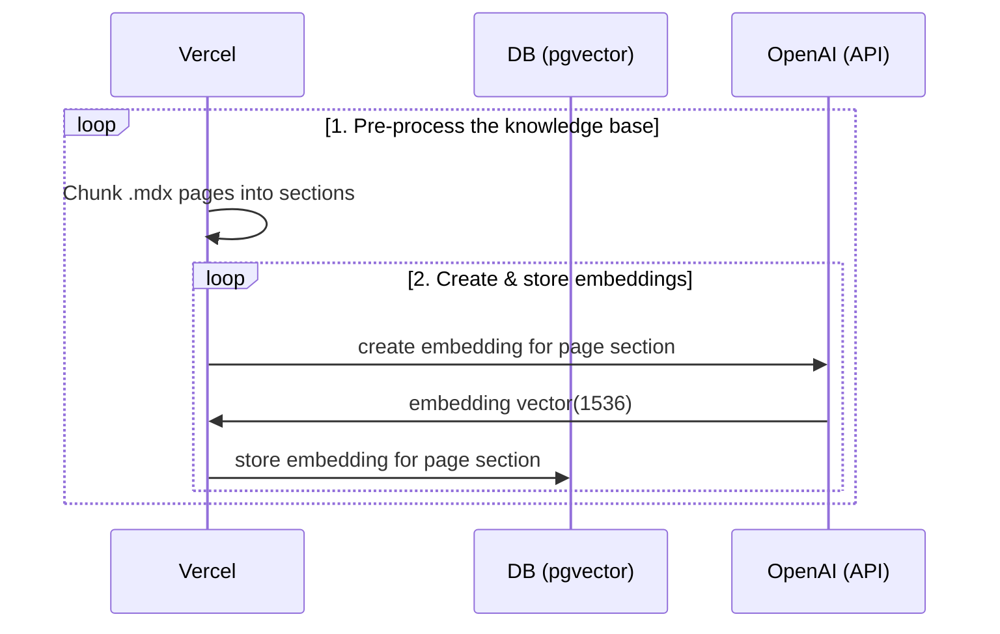

# Vigilante Arch Core Repository

```mermaid
sequenceDiagram
    participant Vercel
    participant DB (pgvector)
    participant OpenAI (API)
    loop 1. Pre-process the knowledge base
        Vercel->>Vercel: Chunk .mdx pages into sections
        loop 2. Create & store embeddings
            Vercel->>OpenAI (API): create embedding for page section
            OpenAI (API)->>Vercel: embedding vector(1536)
            Vercel->>DB (pgvector): store embedding for page section
        end
    end
```
